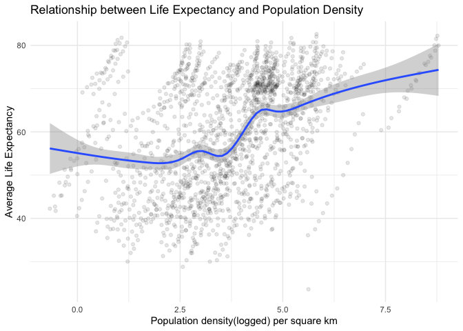
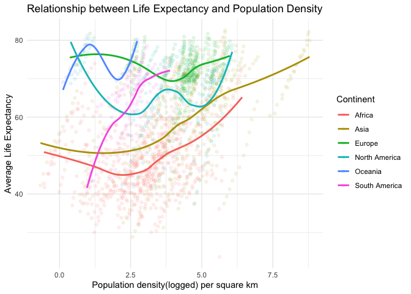

Exploring the gapminder
================
Jue Zhou
11/21/2019

## Gapminder

Here I use the `gapminder` data to explore the relationship between
population density and life expectency.

The population density is calculated using the information of ‘area in
squre kms’ from `geonames` package.

    ## Observations: 1,704
    ## Variables: 6
    ## $ country   <fct> Afghanistan, Afghanistan, Afghanistan, Afghanistan, Af…
    ## $ continent <fct> Asia, Asia, Asia, Asia, Asia, Asia, Asia, Asia, Asia, …
    ## $ year      <int> 1952, 1957, 1962, 1967, 1972, 1977, 1982, 1987, 1992, …
    ## $ lifeExp   <dbl> 28.801, 30.332, 31.997, 34.020, 36.088, 38.438, 39.854…
    ## $ pop       <int> 8425333, 9240934, 10267083, 11537966, 13079460, 148803…
    ## $ gdpPercap <dbl> 779.4453, 820.8530, 853.1007, 836.1971, 739.9811, 786.…

    ## Observations: 250
    ## Variables: 17
    ## $ continent     <chr> "EU", "AS", "AS", "NA", "NA", "EU", "AS", "AF", "A…
    ## $ capital       <chr> "Andorra la Vella", "Abu Dhabi", "Kabul", "Saint J…
    ## $ languages     <chr> "ca", "ar-AE,fa,en,hi,ur", "fa-AF,ps,uz-AF,tk", "e…
    ## $ geonameId     <chr> "3041565", "290557", "1149361", "3576396", "357351…
    ## $ south         <chr> "42.428743001", "22.6315119400001", "29.3770645357…
    ## $ isoAlpha3     <chr> "AND", "ARE", "AFG", "ATG", "AIA", "ALB", "ARM", "…
    ## $ north         <chr> "42.655765", "26.0693916590001", "38.4907920755748…
    ## $ fipsCode      <chr> "AN", "AE", "AF", "AC", "AV", "AL", "AM", "AO", "A…
    ## $ population    <chr> "84000", "4975593", "29121286", "86754", "13254", …
    ## $ east          <chr> "1.78657600000003", "56.381222289", "74.8894511481…
    ## $ isoNumeric    <chr> "020", "784", "004", "028", "660", "008", "051", "…
    ## $ areaInSqKm    <chr> "468.0", "82880.0", "647500.0", "443.0", "102.0", …
    ## $ countryCode   <chr> "AD", "AE", "AF", "AG", "AI", "AL", "AM", "AO", "A…
    ## $ west          <chr> "1.41376000100007", "51.5904085340001", "60.472083…
    ## $ countryName   <chr> "Principality of Andorra", "United Arab Emirates",…
    ## $ continentName <chr> "Europe", "Asia", "Asia", "North America", "North …
    ## $ currencyCode  <chr> "EUR", "AED", "AFN", "XCD", "XCD", "ALL", "AMD", "…

<!-- -->

This graph above shows the relationship between population density and
life expectancy. Generally, as population density increases, life
expectancy increases.

<!-- -->

The second graph shows the relationship between population density and
life expectancy across continents. For Africa, Asia and South America,
the positive relationship between population density and life expectancy
sustains, which indicates this relationship might mainly apply to
developing countries.
